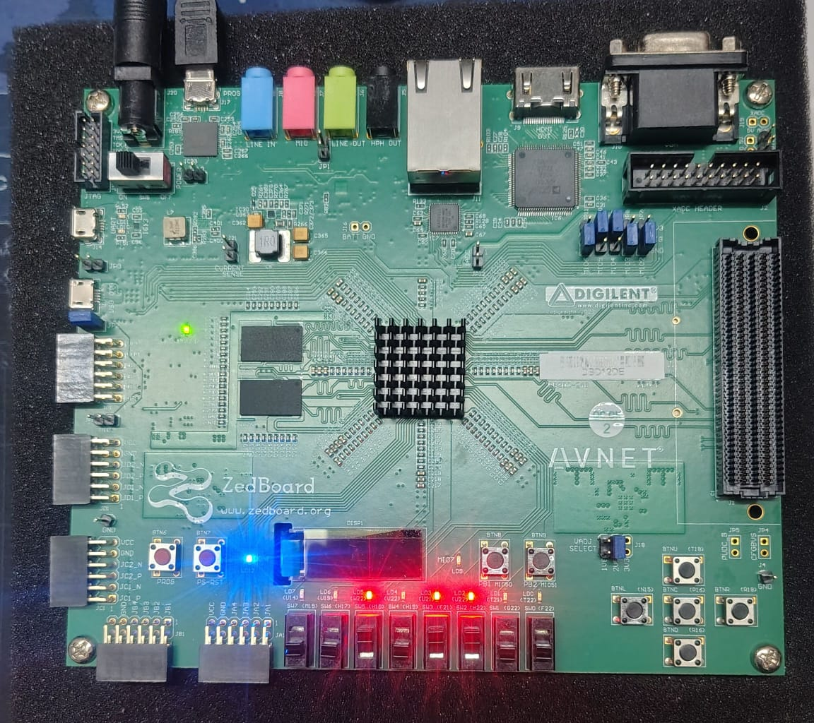
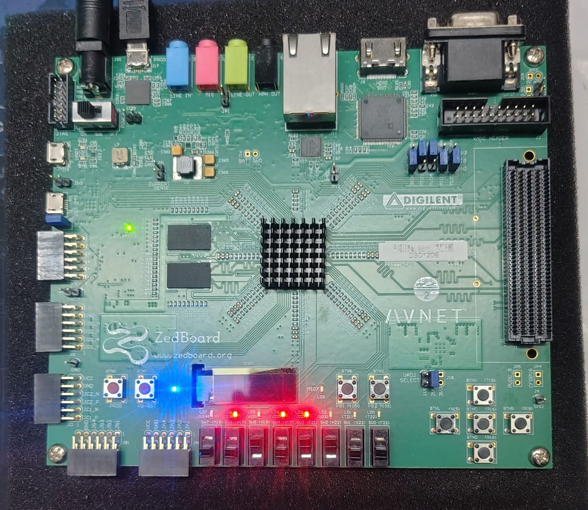
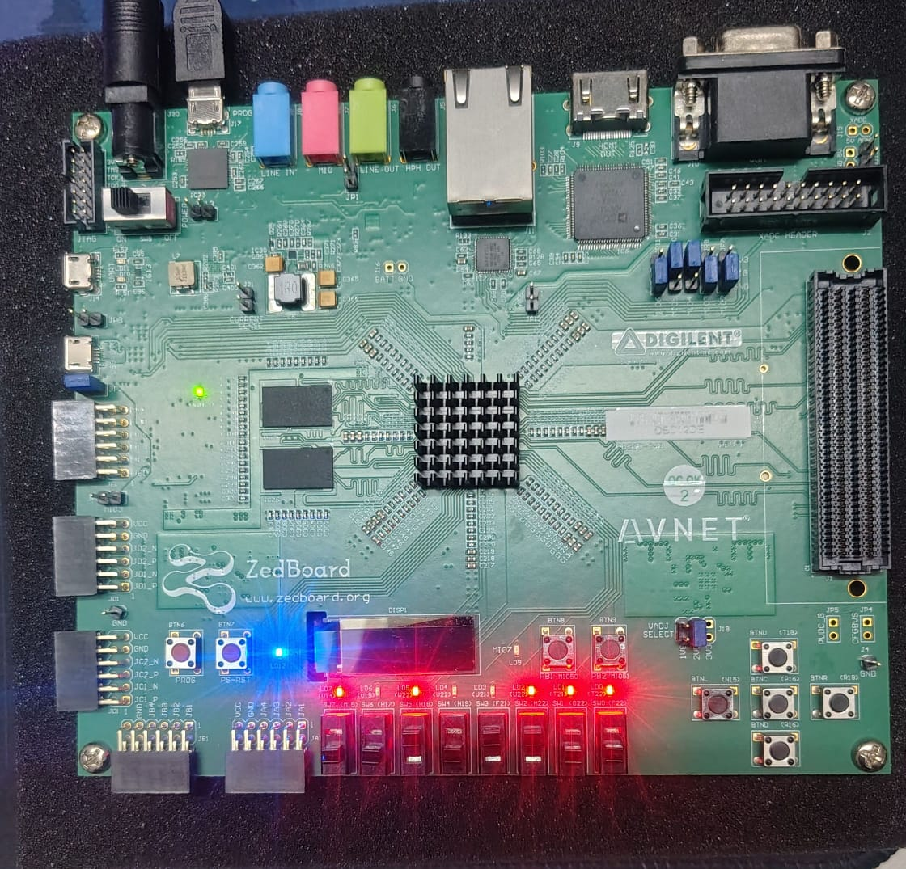
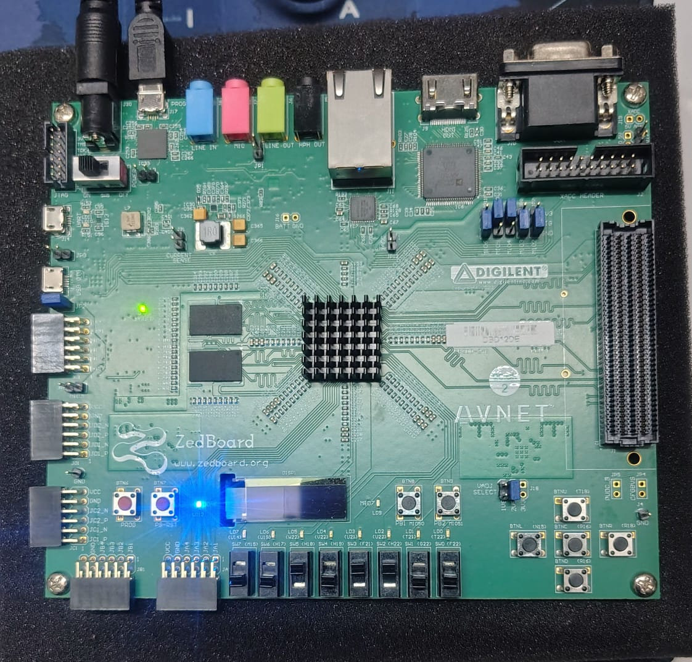

# Push Button Operations – Hardware Verification

This document demonstrates the behavior of each ZedBoard push button using real hardware photos.

---

## 🔼 BTNU – Load Switch Values

**Function:**  
Loads the current slide switch pattern into the LED register.

**Result:**  
LEDs immediately reflect the switch positions.

---

## ⬅️ BTNL – Shift Left

**Function:**  
Shifts the LED register one position to the left on each press.

**Result:**  
One-bit left shift per press, no repeated shifts while holding.

---

## ➡️ BTNR – Shift Right

**Function:**  
Shifts the LED register one position to the right on each press.

**Result:**  
One-bit right shift per press.

---

## 🔄 BTNC – Invert LEDs

**Function:**  
Bitwise inversion of the LED register.

**Result:**  
ON LEDs turn OFF, OFF LEDs turn ON.

---

## ⏹️ BTND – Reset LEDs

**Function:**  
Clears the LED register.

**Result:**  
All LEDs turn OFF.

---

## 🧠 Notes

- Each button press generates exactly **one pulse**
- Mechanical bouncing does not cause repeated actions
- Button hold does **not** repeat the operation
- Behavior verified on real ZedBoard hardware

